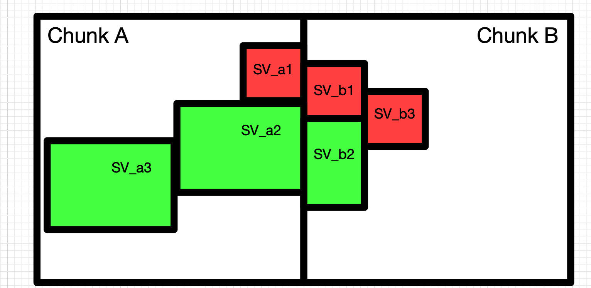

## Serialization

PyChunkedgraph uses protobuf for serialization and zstandard for compression.

Edges and connected components per chunk are stored using the protobuf definitions in [`pychunkedgraph.io.protobuf`](https://github.com/CAVEconnectome/PyChunkedGraph/pychunkedgraph/io/protobuf/chunkEdges.proto).
This format is a result of performance tests.
It provided the best tradeoff between deserialzation speed and storage size.

To read and write edges in this format, the functions `get_chunk_edges` and `put_chunk_edges`
in the module `pychunkedgraph.io.edges` may be used.

[CloudVolume](https://github.com/seung-lab/cloud-volume) is used for uploading and downloading this data.

### Edges

Edges in chunkedgraph refer to edges between supervoxels (group of voxels).
These supervoxels are the atomic nodes in the graph, they cannot be split.

There are three types of edges in a chunk:
1. `in` edge between supervoxels within chunk boundary
2. `between` edge between supervoxels in adjacent chunks
3. `cross` a faux edge between parts of the same supervoxel that has been split across chunk boundary

### Components

A component is simply a mapping of supervoxel to it's connected component.
Components within a single chunk are stored as a numpy array.
```
[
  component1_size,
  supervoxel_a,
  supervoxel_b,
  supervoxel_c,
  component2_size,
  supervoxel_x,
  supervoxel_y,
  ...
]
```

Components include supervoxels from negihboring chunks, this is required to figure out active/inactive edges.
For instance, in the following image (courtsey of Eric Perlman), components from `Chunk A` would look like so:

```
components_A = [3, SV_a2, Sv_a3, SV_b2, 3, SV_a1, SV_b1, SV_b3]
```



### Example usage

```
import numpy as np

from pychunkedgraph.io.edges import get_chunk_edges
from pychunkedgraph.io.edges import put_chunk_edges
from pychunkedgraph.graph.edges import Edges
from pychunkedgraph.graph.edges import EDGE_TYPES

in_chunk = np.array([[1,2],[2,3],[0,2],[2,4]], dtype=np.uint64)
between_chunk = np.array([[1,5]], dtype=np.uint64)
cross_chunk = np.array([[3,6]], dtype=np.uint64)

in_chunk_edges = Edges(in_chunk[:,0], in_chunk[:,1])
between_chunk_edges = Edges(between_chunk[:,0], between_chunk[:,1])
cross_chunk_edges = Edges(cross_chunk[:,0], cross_chunk[:,1])

edges_path = "<path_to_bucket>"
chunk_coordinates = np.array([0,0,0])

edges_d = {
  EDGE_TYPES.in_chunk: in_chunk_edges,
  EDGE_TYPES.between_chunk: between_chunk_edges,
  EDGE_TYPES.cross_chunk: cross_chunk_edges
}

put_chunk_edges(edges_path, chunk_coordinates, edges_d, compression_level=22)
# file will be located at <path_to_bucket>/edges_0_0_0.proto.zst

# reading the file will simply return the previous dictionary
edges_d = get_chunk_edges(edges_path, [chunk_coordinates])

# notice the difference between chunk_coordinates parameter
# put_chunk_edges takes in coordinates for a single chunk
# get_chunk_edges takes in a list of chunk coordinates
```
